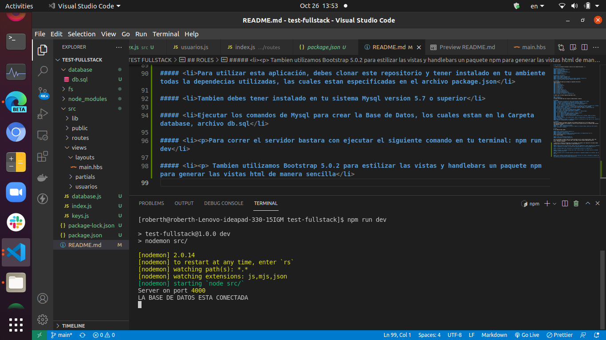
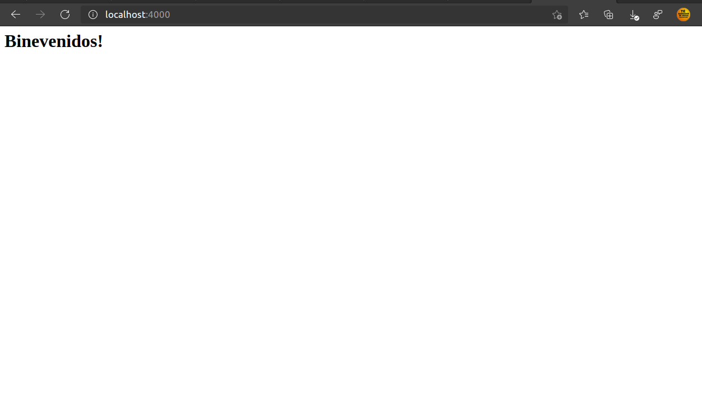
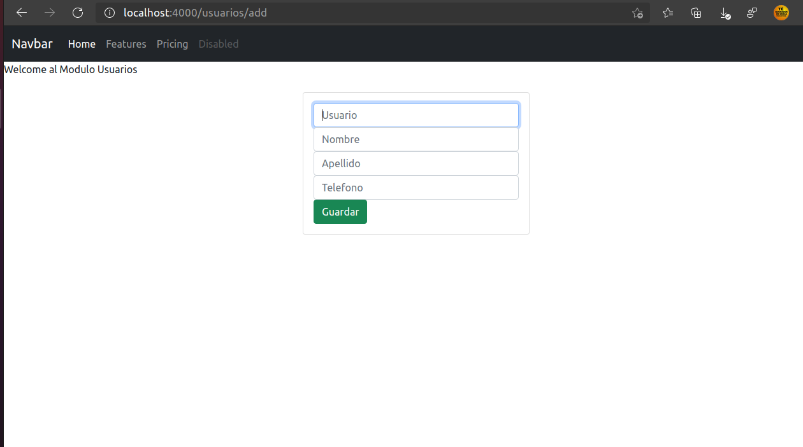

# TEST FULLSTACK

 Este es un proyecto fullstack y estas son las Especificaciones: 

## Competencias técnicas
##### <li>JavaScript/TypeScript</li>
##### <li>CSS3/SCSS</li>
##### <li>Consumo Api-Rest</li>
##### <li>Responsive Boostrap 4+</li>
##### <li>NodeJs</li>
##### <li>Bases de datos</li>

## Requisitos funcionales
##### <li>Usar Angular frontend </li>
##### <li>Usar Node.js backend </li>
##### <li>Consumir alguna base de datos sql (mysql, postgres, oracle)</li>
##### <li>Usar librería de interfaz (Angular bootstrap)</li>

## ACTIVIDAD
Crear una base de datos que contenga la siguiente estructura:
Tabla usuarios
#### <li>ID</li>
#### <li>Usuario</li>
#### <li>Contraseña</li>
#### <li>Nombre</li>
#### <li>Apellido</li>
#### <li>Telefono</li>
#### <li>Id_Rol</li>
#### <li>Fecha creacion</li>
#### <li>Usuario creacion</li>
#### <li>Fecha actualizacion</li>
#### <li>Usuario actualizacion</li>
#### <li>Estado (A = Activo I = Inactivo)</li>

Se debe crear el usuario AdministradorTabla roles

#### <li>ID</li>
#### <li>Nombre</li>
La tabla roles debe tener dos regisros: Administrador y Usuario

## BACKEND
##### 1. Inicializar un proyecto en node.js que consuma la base de datos creada.
##### 2. Realizar la creación de los siguientes servicios (api’s):
##### 2.1. Login: Api de autenticación para los diferentes tipos de usuarios
##### 2.2. Crear usuarios ( habilitado solo para el rol administrador)
#####   <ol> a. El ID del usuario es automático.
#####   <ol> b. El Usuario lo asigna automáticamente el sistema al finalizar el registro así: Primera
##### Letra del Nombre, + Apellido 1 + Primera Letra segundo Apellido. Si el USUARIO
##### coincide con otro creado se incluye la Primera letra del segundo. Se debe validar que
##### no existan dos usuarios iguales.
#####   <ol> Caso 1: Juan José Perez Ramos Usuario : JPEREZR.
#####   <ol> Caso 2: José Joaquin Perez Reyes – JJPEREZR.
##### 2.3. Consulta de usuarios (habilitado solo para el rol administrador)
##### 2.4. Actualizar usuario.
#####   <ol> a. Administrador puede actualizar cualquier usuario
#####   <ol> b. Usuario solo puede actualizar su usuario
#####   <ol> c. Usuario no puede actualizar Estado.
#####   <ol> d. Usuario y fecha de actualización se modifica por el sistema, cuando se realiza
##### cualquier cambio.
##### 2. Eliminar usuario: (solo administrador, además el administrador no se puede eliminar ni
##### por el mismo)
##### Crear/implementar/integrar un sistema que permita la protección de rutas según su rol, realice la
##### creación e integración de un middleware

## FRONTEND
Realice un proyecto con Angular haciendo uso de Angular Bootstrap con el cual pueda consumir
los servicios realizados en el backend, es libre el uso de librerías extra, el Proyecto debe contener
las siguientes vistas.
##### <ol> 1. LOGIN: Formulario de ingreso
##### <ol> 2. CRUD: Visualización de usuarios creados en la base de datos, opción de crear usuario,editar, actualizar y eliminar.

## ROLES
El rol administrador puede...

##### <li>Ver listado de usuarios general</li>
##### <li>Actualizar usuarios</li>
##### <li>Eliminar usuarios (excepto el mismo administrador o el administrador #1)</li>
##### <li>Actualizar usuarios (cualquiera)</li>
El rol usuario puede…

##### <li>Ver su información personal</li>
##### <li>Actualizar su propio usuario</li>

Una vez terminada la prueba, dejar en la base de datos solo el usuario administrador, subir todo
en un repositorio Git público y enviar URL, como también enviar prueba comprimida (base de
datos, frontend y backend).

Este test se realizó con Javascript. En el backend, de acuerdo a los requisitos utilizamos nodejs expressjs para el servidor y mySql para la Base de Datos

##### <li>Para utilizar esta aplicación, debes clonar este repositorio y tener instalado en tu ambiente todas la dependecias utilizadas, las cuales estan especificadas en el archivo package.json</li>

##### <li>Tambien debes tener instalado en tu sistema Mysql version 5.7 o superior</li>

##### <li>Ejecutar los comandos de Mysql para crear la Base de Datos, los cuales estan en la Carpeta database, archivo db.sql</li>

##### <li>
Para correr el servidor bastara con ejecutar el siguiente comando en tu terminal: npm run dev</li>

##### <li>
 Tambien utilizamos Bootstrap 5.0.2 para estilizar las vistas y handlebars un paquete npm para generar las vistas html de manera sencilla</li>

#### DEMO

Iniciando el Servidor</img>
 
Pagina de Inicio</img>
 
End point agregar usuarios</img>

